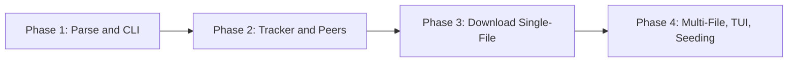

# BitSwift Implementation Phases

This document splits BitSwift into **four implementation phases**. Each phase delivers a **working, testable** slice of the product. Phases build on each other; finish one before starting the next.

Reference: [PRODUCT_SPEC.md](PRODUCT_SPEC.md).

---

## Overview

| Phase | Name | Deliverable | How to test |
|-------|------|-------------|-------------|
| **1** | Torrent parsing and CLI | Parse `.torrent` files and expose metadata via CLI | Run on a valid/invalid `.torrent`; verify output or error |
| **2** | Tracker and peer connections | Contact tracker(s) and complete handshake with peers | Run on a live torrent; verify peer list and handshaken connections |
| **3** | Download engine (single-file) | Download and write a single-file torrent to disk | Run on a single-file torrent; verify file on disk and integrity |
| **4** | Multi-file, TUI, options, seeding | Multi-file torrents, TUI, all CLI options, seeding | Run multi-file torrent with TUI/options; verify structure and seeding |

---

## Phase 1: Torrent Parsing and CLI

**Goal:** Read and validate `.torrent` files; expose metadata via the CLI. No network, no download.

### In scope

- **Bencode parser:** Decode integers, strings, lists, and dictionaries.
- **Torrent parser:** Parse a `.torrent` file and extract:
  - Announce URL (single `announce`).
  - Optional `announce-list` (backup trackers).
  - Info dictionary: `name`, `piece length`, `pieces` (concatenated SHA-1 hashes).
  - Single-file: `length` (file size).
  - Multi-file: `files` (list of `path` + `length`).
  - **Info hash:** SHA-1 of the bencoded `info` dictionary (used later for tracker and handshake).
- **CLI entrypoint:** `bitswift <path_to_torrent>` (no options required for this phase).
  - On success: print a short summary (e.g. name, info hash hex, piece count, file count/size).
  - On invalid/corrupt file: exit with a clear error message and non-zero exit code; do not crash.

### Out of scope for Phase 1

- Tracker communication, peers, download, TUI, `-o` / `-p` / `--seed` / `--no-tui`.

### Testability

| Test | Expected result |
|------|-----------------|
| `bitswift valid.torrent` | Exits 0; prints name, info hash, piece count, file info. |
| `bitswift missing.torrent` | Exits non-zero; clear "file not found" (or similar) message. |
| `bitswift corrupt.torrent` | Exits non-zero; clear "invalid torrent" or parse error message. |
| Unit tests: bencode decode | Integers, strings, lists, dicts decode correctly. |
| Unit tests: info hash | Same `.torrent` always yields same info hash (e.g. compare to known value). |

### Definition of done

- Bencode and torrent parsing implemented and covered by tests.
- CLI runs and prints metadata for valid `.torrent`; fails cleanly for invalid input.
- No network or file download code required.

---

## Phase 2: Tracker and Peer Connections

**Goal:** Contact tracker(s) and establish BitTorrent handshake with peers. No piece transfer yet.

### In scope

- **Tracker client:**
  - HTTP GET to announce URL with required query params: `info_hash`, `peer_id`, `port`, `uploaded`, `downloaded`, `left`, `compact=1`.
  - Parse response (bencoded) for `peers` (compact binary or list of dicts).
  - Cap peer list size (e.g. 200).
  - On failure: retry with backoff; if `announce-list` exists, try backup trackers.
- **Tracker URL validation:** Allow only `http://` or `https://`; reject `file://`, `localhost`, etc.
- **Peer connection and handshake:**
  - TCP connect to each peer (IP, port).
  - Send/receive BitTorrent handshake: protocol string, reserved bytes, info hash, peer id.
  - Reject connections that don’t match the torrent’s info hash.
- **Peer list management:** Hold a list of (IP, port) and handshake status (success/fail/timeout).
- **CLI:** `bitswift <path_to_torrent>` (optionally `-p PORT` for this phase).
  - Parse torrent (Phase 1).
  - Contact tracker; display "Peers: N" or list of peers.
  - Attempt handshake with up to M peers (e.g. 10); report how many handshook successfully.
  - Then exit (no download).

### Out of scope for Phase 2

- Choke/unchoke, piece requests, download, file writing, TUI, `-o` / `--seed` / `--no-tui`.

### Testability

| Test | Expected result |
|------|-----------------|
| `bitswift live_single_file.torrent` | Exits 0; prints peer count; at least one handshake succeeds (if swarm is active). |
| `bitswift torrent_with_backup_trackers.torrent` | If primary fails, backup tracker is tried. |
| Unit/integration: tracker response parsing | Compact and non-compact `peers` parsed correctly. |
| Unit: handshake encode/decode | Handshake bytes match BitTorrent spec; info hash and peer id round-trip. |

### Definition of done

- Tracker client implemented; peer list retrieved and parsed.
- Peer TCP + handshake implemented; handshaken connections can be counted/reported.
- CLI demonstrates "connect to tracker → get peers → handshake" and exits without downloading.

---

## Phase 3: Download Engine (Single-File)

**Goal:** Download a **single-file** torrent and write it to disk. Verify pieces with SHA-1. No TUI yet; optional simple progress (e.g. log lines or a single progress line).

### In scope

- **Data structures:** Bitfield, piece state (missing / in-flight / verified), work queue (piece indices to request).
- **Choke/unchoke:** Maintain state per peer (choked by peer? peer interested?). Minimal policy: unchoke up to N peers (e.g. 4); prefer interested; re-evaluate periodically (e.g. 10s).
- **Piece selection:** Implement at least **sequential** (simplest); optionally rarest-first.
- **Block requests:** 16 KB blocks; request a piece as a sequence of blocks; handle `piece` messages and reassemble.
- **Piece verification:** SHA-1 of completed piece vs torrent’s piece hashes; only mark piece complete when it matches.
- **File writer:** Single-file only. Write verified pieces to one file in the output directory; name from `info.name`. Pre-allocate file (or grow as pieces complete) and write each piece to the correct offset.
- **Concurrency:** Multiple peers (e.g. 10–50); each can be assigned different pieces; respect choke/unchoke.
- **CLI:** `bitswift -o <dir> <path_to_torrent>` (and `-p PORT`).
  - Parse torrent (Phase 1).
  - Get peers and handshake (Phase 2).
  - Download all pieces; verify; write to `<dir>/<name>`.
  - On completion: exit 0; optionally print "Download complete" and path.
- **Error handling:** Peer disconnect → drop peer, keep piece state; re-request in-flight pieces from others. Tracker re-announce on interval if needed. Disk full → abort with clear error.

### Out of scope for Phase 3

- Multi-file torrents (directory structure, multiple files).
- TUI (progress bar, live speed, ETA).
- `--seed`, `--no-tui`.

### Testability

| Test | Expected result |
|------|-----------------|
| `bitswift -o ./out small_single_file.torrent` | File `./out/<name>` created; size equals torrent length; piece hashes verify (or compare file hash to expected). |
| Integration: real single-file torrent | Download completes; file is usable (e.g. checksum or open with known app). |
| Unit: piece verification | Correct data passes SHA-1; wrong data fails. |
| Unit: file writer | Written bytes match piece data at correct offsets. |

### Definition of done

- Full download of a single-file torrent works end-to-end.
- Pieces are verified with SHA-1; only verified data is written.
- Choke/unchoke and multiple peers are used; disconnect handling does not crash the client.

---

## Phase 4: Multi-File, TUI, Options, and Seeding

**Goal:** Support **multi-file** torrents, add the **TUI**, implement all **CLI options**, and support **seeding** after download.

### In scope

- **Multi-file torrents:**
  - Parse `info.files`; build mapping from (piece index, offset in piece) to (file path under `info.name`, offset in file).
  - Create directory `info.name` under output dir; create subdirs as needed; write blocks to the correct file and offset.
  - Pre-allocate or grow each file as pieces complete.
- **TUI (default):**
  - Progress: percentage complete (from verified pieces).
  - Transfer rates: current download and upload (e.g. KB/s or MB/s).
  - Peer count: seeds and leeches.
  - ETA: estimated time remaining when rate is available.
  - Refresh interval: e.g. 1 second.
- **CLI options (full set):**
  - `-o, --output`: Download directory (already in Phase 3).
  - `-p, --port`: Incoming port or range (e.g. 6881 or 6881–6889).
  - `--seed`: After download completes, switch to seeding mode (unchoke interested peers, respond to requests).
  - `--no-tui`: No TUI; run headless; print final summary only (for scripting).
- **Seeding:**
  - When download is 100%, if `--seed` then: keep peer connections; unchoke interested peers; serve requested pieces from disk (read piece, send to peer).
  - Choke/unchoke policy for seeding: unchoke up to N interested peers; re-evaluate periodically.
- **Robustness and security (per spec):**
  - Tracker and peer error handling (timeout, 4xx/5xx, disconnect).
  - Bounds-check piece index and block offset in requests.
  - Cap peer list and connections (e.g. max 50 peers).

### Out of scope for Phase 4

- Magnet links, DHT, PEX, resume, encryption, BitTorrent v2.

### Testability

| Test | Expected result |
|------|-----------------|
| `bitswift -o ./out multi_file.torrent` | Directory `./out/<name>/` created with correct files and structure; all piece hashes verify. |
| `bitswift --no-tui -o ./out file.torrent` | No TUI; download completes; final summary printed; exit 0. |
| `bitswift -o ./out -p 6882 file.torrent` | Download uses port 6882 (or range). |
| `bitswift -o ./out --seed file.torrent` | After 100%, client stays running and serves data to peers (observe upload traffic or peer requests). |
| TUI | Progress, speed, peers, and ETA update roughly every second during download. |

### Definition of done

- Multi-file torrents download and produce correct directory and file contents.
- TUI shows progress, speeds, peer count, and ETA; `--no-tui` runs headless with final summary.
- All CLI options work as specified in PRODUCT_SPEC.
- Seeding mode keeps the client running and uploads to interested peers.
- Error handling and security constraints from the spec are applied.

---

## Dependency Summary

- **Phase 1** has no product dependencies (only language/runtime and test harness).
- **Phase 2** depends on Phase 1 (torrent metadata and info hash).
- **Phase 3** depends on Phase 1 and Phase 2 (metadata, tracker, peers, handshake).
- **Phase 4** depends on Phase 3 (adds multi-file, TUI, options, seeding on top of the working download engine).

---

## Suggested Order of Work

1. Implement and test **Phase 1** until the definition of done is met.
2. Implement and test **Phase 2**; verify with at least one live torrent.
3. Implement and test **Phase 3**; verify with a small single-file torrent.
4. Implement and test **Phase 4**; verify with a multi-file torrent and with `--seed` and `--no-tui`.

Each phase should be **independently testable**: you can run the binary (or tests) for that phase without needing features that belong to a later phase.
