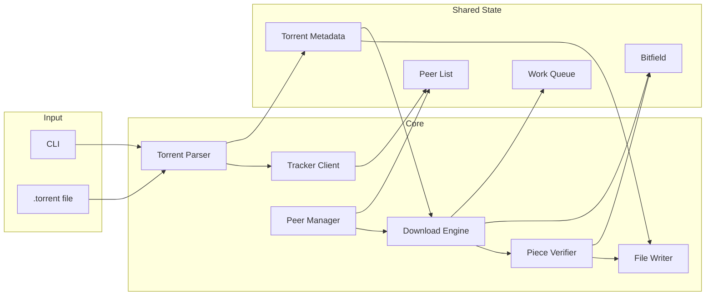

# BitSwift Product Specification

**BitSwift** — A lightweight, CLI-first BitTorrent client for the terminal.

| | |
|---|---|
| **Spec version** | 1.0 |
| **Protocol** | BitTorrent v1.0 only. No DHT, no PEX. |

---

## 1. Product Summary

BitSwift is a terminal-based BitTorrent client designed for users who value speed, low resource consumption, and the ability to manage downloads in headless or remote environments. It implements the core **BitTorrent v1.0** protocol, focusing on reliable piece-by-piece downloading and peer-to-peer file sharing via trackers only (no distributed hash table or peer exchange in v1).

---

## 2. Target Persona

- **The Power User:** Developers or Linux enthusiasts who prefer the terminal over heavy GUIs.
- **The Server Admin:** Users running seedboxes or home servers (e.g., Raspberry Pi) who need to download files via SSH.

---

## 3. Goals and Success Criteria

**Goals:**

- Lightweight: minimal RAM and CPU usage.
- CLI-first: invoked from the terminal; scriptable when needed.
- Transparent: clear progress, speeds, and peer counts.
- Low resource use: suitable for constrained environments.

**Success criteria:**

- The client can download a real single-file and multi-file torrent from public trackers.
- The TUI shows progress (%), download/upload speed, seed/peer counts, and ETA.
- Memory footprint stays under 50 MB RAM for a typical ~1 GB torrent.

---

## 4. Functional Requirements

### 4.1 Torrent File and Magnet Handling

**Torrent files (.torrent):**

- **Bencode parser:** The client must decode `.torrent` files using the Bencode format to extract:
  - Announce URL (and optional announce-list for backup trackers).
  - Info dictionary: file name or directory name, piece length, piece hashes (SHA-1), and for multi-file torrents the `files` list (path + length).
  - Info hash: SHA-1 of the bencoded info dictionary, used as the torrent identifier.
- **Verification:** Support SHA-1 hash verification of each downloaded piece to ensure data integrity.

**Acceptance criteria:**

- Given a valid `.torrent` file, the client extracts announce URL(s), info hash, piece length, and file list (single or multi-file) without error.
- Given an invalid or corrupt `.torrent` file, the client exits with a clear error message and does not crash.

**Magnet links (Phase 2):**

- Magnet support is **out of scope for Phase 1**. Phase 2 may include: decode `xt=urn:btih:<info_hash>` and optional `tr=` tracker URLs; bootstrap via trackers only (no DHT).

---

### 4.2 Peer Management

- **Tracker communication:** Send HTTP GET requests to trackers (with required parameters: info_hash, peer_id, port, uploaded, downloaded, left, compact=1) to receive a list of active peers. Support backup trackers from `announce-list` when the primary fails.
- **Peer handshake:** Implement the BitTorrent handshake protocol to establish connections with peers (Protocol identifier, reserved bytes, info hash, peer id).
- **Choke/unchoke state:** Maintain for each peer: am I choked by this peer? Is the peer interested in my data?
- **Choke/unchoke policy:**
  - **Downloading:** Unchoke up to N peers (e.g., 4); prefer peers that are interested. Re-evaluate periodically (e.g., every 10 seconds) to rotate unchoked peers and improve throughput.
  - **Seeding:** Unchoke peers that are interested, up to the same limit; periodic re-evaluation.

**Acceptance criteria:**

- Given a valid tracker response, the client parses the peer list (compact or non-compact) and attempts to connect to peers.
- Each peer connection reaches the handshake state and correctly reflects choke/unchoke and interested state.

---

### 4.3 Download Engine

- **Piece selection:** Use a configurable strategy: "Rarest-First" (default) or "Sequential" to decide which piece to request next. Rarest-first improves swarm health; sequential simplifies debugging and streaming.
- **Block requests:** Request pieces in blocks (e.g., 16 KB). Standard block size is 2^14 bytes (16 KB). Pieces are requested as a sequence of blocks until the piece is complete.
- **Concurrency:** Support multiple simultaneous TCP connections to different peers (recommended: 10–50; cap at a configurable maximum, e.g., 50).
- **Single-file vs multi-file:** Both are supported. For multi-file torrents, the logical content is the concatenation of all files in the order defined in the `files` list; piece boundaries span this concatenation. The client maps piece index and offset to the correct file path and offset for writing (see 4.4).

**Acceptance criteria:**

- Missing pieces are requested from peers that have them; rarest-first or sequential behavior matches the selected strategy.
- Multiple peers are used concurrently; completed pieces are verified with SHA-1 before being marked complete.

---

### 4.4 Storage and File Reconstruction

- **Single-file torrent:** One file; name from `info.name`; write to the output directory.
- **Multi-file torrent:** Directory `info.name`; under it, create files according to `info.files` (path and length). Pieces span the concatenated content; the client must map (piece index, block offset, length) to (file path, offset in file) and write blocks to the correct file and position.
- **File reconstruction:** Assemble downloaded and verified pieces into the final file structure on disk. Create subdirectories as needed for multi-file torrents.

**Acceptance criteria:**

- After a full download, the resulting file(s) on disk match the torrent’s file list and pass piece verification.
- Multi-file torrents produce the correct directory structure and file contents.

---

## 5. Technical Specifications

### 5.1 CLI

The client is invoked via:

```bash
bitswift [options] <torrent_file>
```

**Phase 1:** Only `<torrent_file>` (path to a `.torrent` file) is supported. Magnet URI is Phase 2.

**Options:**

| Option | Short | Description | Default |
|--------|-------|-------------|---------|
| `--output` | `-o` | Download directory | Current directory |
| `--port` | `-p` | Incoming port or range (e.g. `6881` or `6881-6889`) | `6881` |
| `--seed` | `-s` | Continue seeding after download completes | Off |
| `--no-tui` | | Disable TUI; print final summary only (for scripting/headless) | TUI on |

**Port:** Default is 6881. Many clients use 6881–6889; the client may allow a range so the OS can choose an available port. Firewall/NAT must allow incoming TCP on the chosen port for best connectivity.

---

### 5.2 User Interface (TUI)

- **Mode:** Single process. By default, a basic text-based UI (TUI) is shown with live stats. With `--no-tui`, the client runs headless and prints only a final summary (and exit code).
- **TUI fields:**
  - **Progress:** Percentage of completion (based on verified pieces).
  - **Transfer rates:** Current download and upload speeds (e.g., MB/s or KB/s).
  - **Peer count:** Number of active seeds and leeches.
  - **Time remaining:** Estimated time to completion (ETA), when computable.
- **Update interval:** Refresh TUI at a fixed interval (e.g., 1 second) to avoid flicker and excessive CPU.

---

### 5.3 Data Structures

| Component | Description |
|-----------|-------------|
| **Bitfield** | A bit array representing which pieces the client currently possesses (and has verified). |
| **Piece state** | Per-piece state: not started, requested/in-flight, or verified. Used to avoid re-requesting in-flight pieces and to drive the work queue. |
| **Work queue** | A concurrent queue (or equivalent) of piece indices that are missing and available for workers to request. Fed by piece selection (rarest-first or sequential). |
| **Block requests** | Pieces are requested in blocks (e.g., 16 KB). Track which blocks of a piece are requested or received. |
| **Peer list** | Dynamic list of (IP, port) pairs from the tracker(s). Updated on each successful tracker response. |
| **Torrent metadata** | In-memory structure after parsing: announce URLs, info hash, piece length, piece hashes, file list (single or multi-file), and mapping from (piece index, offset) to (file path, file offset) for writing. |

---

## 6. Error Handling and Edge Cases

| Scenario | Expected behavior |
|----------|-------------------|
| **Tracker timeout** | Retry with backoff (e.g., exponential); optionally try backup trackers from announce-list. |
| **Tracker 4xx/5xx** | Treat as failure; retry after backoff; try backup trackers if present. |
| **Peer disconnect** | Drop the peer; keep all piece state (completed and in-flight); other peers continue. In-flight pieces from the dropped peer may be re-requested from others. |
| **Disk full** | Abort download; exit with a clear error message. |
| **Invalid/corrupt torrent file** | Exit with a clear error message; do not start the download. |
| **No peers returned** | Keep retrying tracker requests with backoff; optionally show "waiting for peers" in TUI. |

---

## 7. Security Considerations

- **Tracker URL:** Validate tracker URLs to allow only `http://` or `https://` schemes. Reject `file://`, `localhost`, and other non-http(s) URLs to avoid local or unintended requests.
- **Peer list:** Cap the number of peers accepted from the tracker (e.g., limit to 200) to avoid excessive memory or connection attempts.
- **Piece/block requests:** Bounds-check piece index and block offset/length against the torrent metadata before sending or processing requests to prevent out-of-bounds access.
- **Resource limits:** Optionally enforce limits on max open connections and max open files to avoid resource exhaustion (e.g., on seedboxes with many torrents).

---

## 8. Performance and Constraints

- **Memory footprint:** Should not exceed ~50 MB RAM for a standard ~1 GB file download (excluding OS and runtime).
- **CPU:** Optimize SHA-1 hashing (e.g., incremental or batched) to avoid CPU spikes during piece verification.
- **Networking:** Handle peer timeouts and unexpected disconnections gracefully without crashing; reconnect to tracker and peers as per error-handling section.
- **Scalability:** Support a configurable maximum number of peers (e.g., 50); cap open sockets accordingly. Support piece sizes in the common range (e.g., 16 KB–4 MB); for unusually large piece sizes, document or cap to avoid excessive memory per piece.

---

## 9. Out of Scope / Future Work

**Out of scope for v1 (Phase 1):**

- DHT (Distributed Hash Table).
- PEX (Peer Exchange).
- Magnet links (Phase 2 candidate).
- Protocol encryption.
- WebTorrent or other non-TCP transports.
- BitTorrent v2 (BEP 52) or hybrid torrents.
- Resume/partial download (Phase 2 candidate).

**Phase 2 candidates:**

- Resume: persist bitfield (and optionally partial pieces or only completed pieces); resume from checkpoint on restart.
- Magnet link support: parse `xt=urn:btih:<info_hash>` and `tr=`; bootstrap via trackers only.
- Config file for default options (port, download dir, max peers, etc.).
- Optional DHT for peer discovery without trackers.

---

## 10. High-Level Architecture

The following diagram summarizes the main components and data flow:



- **CLI** parses arguments and passes the torrent file path to the **Torrent Parser**.
- **Torrent Parser** decodes the `.torrent` file and produces **Torrent Metadata**; it also triggers **Tracker Client** to fetch peers into **Peer List**.
- **Peer Manager** uses **Peer List** to establish and maintain connections; it feeds the **Download Engine** with connected peers.
- **Download Engine** uses **Work Queue** and **Bitfield** to request pieces from peers, then passes completed piece data to **Piece Verifier**.
- **Piece Verifier** checks SHA-1 and updates **Bitfield**; verified pieces are passed to **File Writer**, which uses **Torrent Metadata** to write blocks to the correct file paths.
